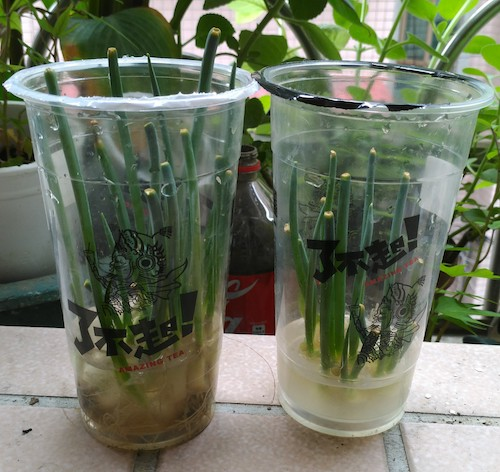

# twfarmer.github.io
台灣農夫小子葉冠緯

## 採收記錄
1. 8/17（二）採收阿公種的2顆火龍果
2. 8/18（三）採收10片葉子
3. 8/19（四）照顧昨天種的鳳梨頭
4. 8/20（五）種的青蔥發的芽變長了
5. 8/21（六）空心菜長高了
6. 8/22（日）鳳梨頭好像死掉了
7. 8/23（一）青蔥變高了
8. 8/24（二）阿公種的冬瓜有30公分了
9. 8/25（三）阿公種的另一條冬瓜，頭長得比較大
10.8/26（四）這是我家的蓮蕉花，看起來很高喔！

)
## 每天要做的事
1. 澆水
2. 照顧
3. 採收（不一定每天採收得到）
